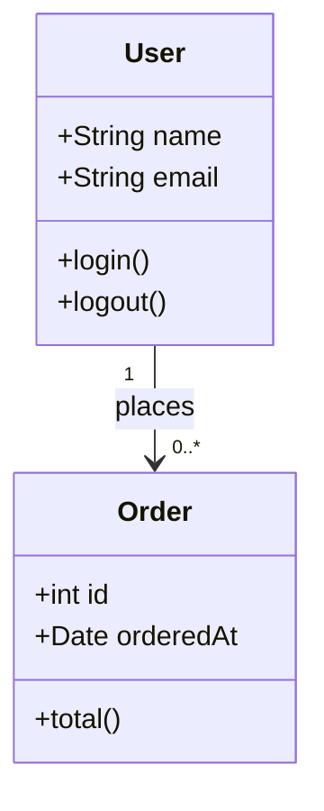
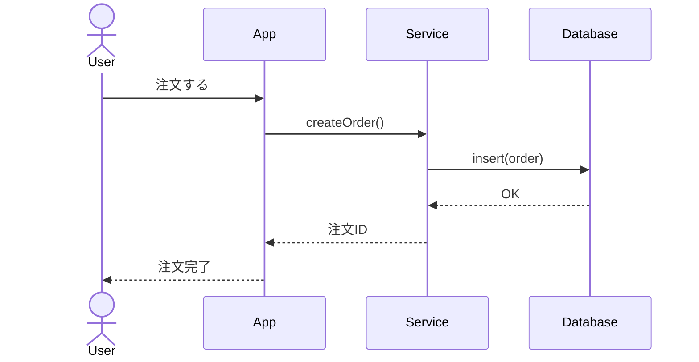
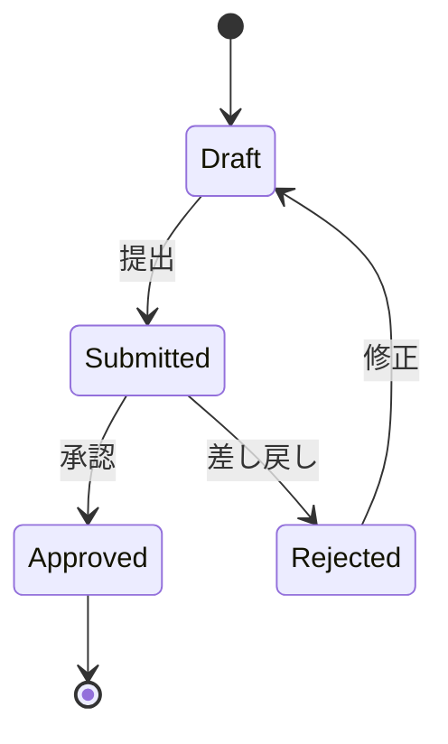
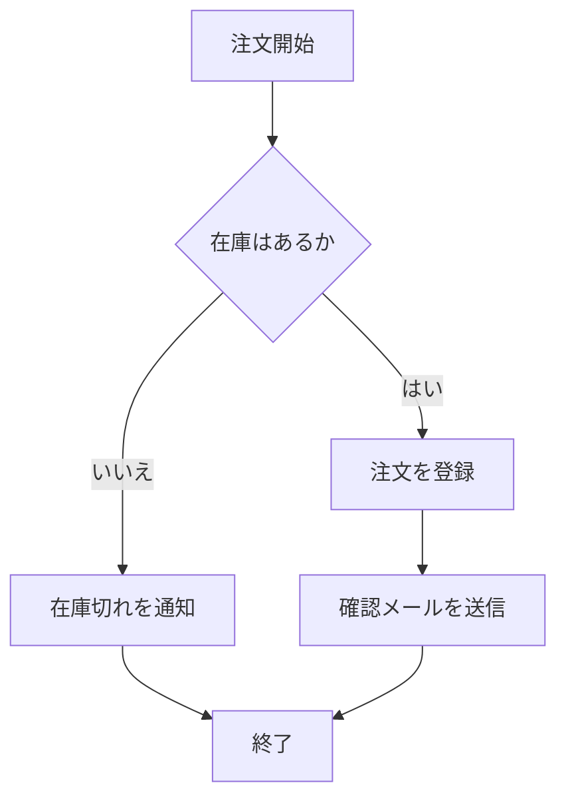
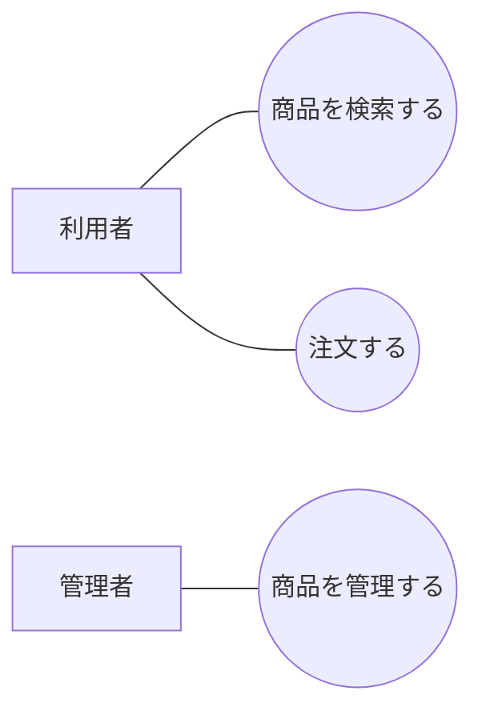

## はじめに

あ、あの…この記事は、みくくが担当します。今日は UML の入口を、少しだけ順番をひっくり返して整理してみます。

UML を学ぼうとすると、最初にたくさんの図の名前が出てきます。クラス図、シーケンス図、ユースケース図、アクティビティ図、ステートマシン図、コンポーネント図。どれも大事なのですが、最初から全部並ぶと、少し身構えてしまうかもしれません。

そこでこの記事では、UML の用語を最初から全部説明するのではなく、まず Mermaid で図を書いてみます。そのあとで、「いま書いた図は UML では何に近いのか」を見ていきます。

ソフトウェアの設計を文章だけで説明しようとすると、だんだん苦しくなることがあります。クラス同士の関係、処理の呼び出し順、状態の変化。こうしたものは、文章で書けないわけではありません。でも、文章だけで書くと、読み手によって解釈がずれたり、あとから直したときに前後の説明と矛盾したりしやすくなります。

一方で、最近の開発ドキュメントは Markdown で書くことが多くなりました。README、設計メモ、仕様メモ、ADR、Issue、Pull Request の説明。どれも、テキストとして管理しやすいことが大事です。

さらに、生成AIに設計メモや README の下書きを作ってもらう場面も増えています。あの…この記事では生成AIそのものを主題にはしません。ただ、生成AIが Markdown を作る流れの中で、Mermaid のコードブロックがふっと出てくることがあります。そのとき、書かれている図が何を表しているのかを読めると、設計メモを受け取る側としてかなり楽になります。

そこで便利なのが Mermaid です。Mermaid は、テキストで図を書ける記法です。Markdown の中にそのまま置けて、GitHub などの環境では図として表示できます。図を画像ファイルとして別管理するのではなく、設計メモの本文と同じ場所で、テキストとして差分管理できます。

そして、Mermaid でクラス図、シーケンス図、状態遷移図のような図を書いていくと、自然に UML の考え方に近づいていきます。

この記事は Mermaid 全体の入門ではありません。グラフ、円グラフ、ガントチャートなど、Mermaid にはいろいろな図があります。でも今回は、その中でも UML と関係が深いところ、そして少し周辺にある設計図として読めるところに絞ります。

UML の細かい記法を最初から全部覚えるのではなく、Mermaid の具体例を見ながら、設計図として何を表しているのかを少しずつ整理していきます。うぅ…UML は少し大きな世界ですが、まずは図を書きながら、そして図を読み解きながら入ってみます。

## まずクラスらしきものを書いてみる

最初に、クラスらしきものを書いてみます。ここでは、利用者が注文を持つ、という小さな例にします。



Mermaid では、`classDiagram` と書くとクラス図のような図を書けます。`User` と `Order` というクラスがあり、それぞれに属性や操作があります。そして `User` から `Order` へ関連があります。

この例では、`User` は 1 人で、`Order` は 0 個以上あります。つまり、1 人の利用者が複数の注文を持つことがある、という関係を表しています。

## この図は、UMLではクラス図に近いです

いま書いた Mermaid の `classDiagram` は、UML では **クラス図** に近いものです。

クラス図は、システムの静的な構造を表す図です。プログラムが実行されているときの時間の流れではなく、クラス、属性、操作、関連、継承、実装などを表します。

先ほどの例でいうと、次のように読めます。

- `User` と `Order` というクラスがある
- `name`、`email`、`id`、`orderedAt` は属性である
- `login()`、`logout()`、`total()` は操作である
- `User` と `Order` の間には関連がある
- `User "1" --> "0..*" Order` は、1 人の利用者が 0 個以上の注文と関係することを表す

あの…ここで大事なのは、クラス図はコードをそのまま写すためだけの図ではない、ということです。クラス同士の関係や、設計上の構造を考えるための図です。コードより少し抽象的に、でも文章だけよりは具体的に、構造を見るための道具です。

## 次に、処理のやり取りを書いてみる

次は、注文を作るときのやり取りを書いてみます。



Mermaid では、`sequenceDiagram` と書くと、登場人物や部品の間でメッセージがやり取りされる様子を書けます。ここでは、利用者、アプリ、サービス、データベースが出てきます。

上から下へ時間が流れます。利用者がアプリに「注文する」と伝え、アプリがサービスを呼び、サービスがデータベースへ保存し、結果が戻ってきます。

## この図は、UMLではシーケンス図です

いま書いた Mermaid の `sequenceDiagram` は、UML では **シーケンス図** に対応します。

シーケンス図は、オブジェクトや部品が、時間の流れに沿ってどのようにメッセージを送り合うかを表す図です。処理の順番、呼び出し先、戻り値、どこで何が起きるのかを整理するときに使います。

シーケンス図では、横方向に登場する相手が並び、縦方向に時間が流れます。矢印は、メッセージや呼び出しを表します。

先ほどの例でいうと、次のことが見えます。

- 利用者の操作から処理が始まる
- アプリはサービスに処理を委譲する
- サービスはデータベースへ注文を保存する
- 保存結果がサービス、アプリ、利用者へ戻る

文章で「利用者が注文すると、アプリがサービスを呼び、サービスがデータベースに保存して…」と書くこともできます。でも、やり取りが増えると文章だけでは追いにくくなります。シーケンス図にすると、呼び出し順が見えやすくなります。

## 状態の変化を書いてみる

次は、注文の状態が変わる様子を書いてみます。



Mermaid では、`stateDiagram-v2` と書くと、状態と状態遷移を表せます。ここでは、下書き、提出済み、承認済み、差し戻しという状態があります。

`Draft` から `Submitted` へは「提出」で遷移します。`Submitted` から `Approved` へは「承認」で遷移します。差し戻された場合は、`Rejected` から `Draft` に戻って修正できます。

## この図は、UMLではステートマシン図に近いです

いま書いた Mermaid の `stateDiagram-v2` は、UML では **ステートマシン図** に近いものです。

ステートマシン図は、ある対象がどのような状態を持ち、どのイベントで別の状態へ遷移するかを表します。画面、注文、申請、チケット、ジョブ、接続など、状態を持つものを整理するときに役に立ちます。

状態を文章だけで書くと、抜け漏れが出やすくなります。

```text
注文は下書きから提出できる。
提出された注文は承認または差し戻しできる。
差し戻された注文は修正して再提出できる。
承認された注文は完了扱いになる。
```

この文章も悪くありません。でも、状態が増えると、どこからどこへ行けるのかが見えにくくなります。状態遷移図にすると、許される遷移と、存在しない遷移を見分けやすくなります。

うぅ…状態を持つものは、最初は簡単そうに見えても、あとから分岐が増えがちです。だから早めに図にしておくと、考えやすくなります。

## 処理の流れを書いてみる

次は、注文処理の流れを、もう少しフローチャートに近い形で書いてみます。



Mermaid の `flowchart` は、とてもよく使われる図です。開始、判断、処理、終了などをつなげて、流れを表せます。

この図では、注文が始まり、在庫の有無を確認し、在庫があれば注文登録と確認メール送信へ進みます。在庫がなければ、在庫切れを通知して終了します。

## この図は、UMLではアクティビティ図に近いです

Mermaid の `flowchart` は UML そのものではありません。ただ、用途としては UML の **アクティビティ図** に近い使い方ができます。

アクティビティ図は、処理や業務の流れを表す図です。条件分岐、並行処理、開始、終了などを使って、全体の流れを整理します。

厳密な UML のアクティビティ図とは記法が違います。でも、Markdown の中で処理の流れを説明したいときには、Mermaid の `flowchart` はとても使いやすい入口になります。

ここは、少し注意が必要です。Mermaid の `flowchart` を使っているからといって、それがそのまま UML のアクティビティ図になるわけではありません。けれど、処理の流れを矛盾なくテキストで残すという目的では、かなり実用的です。

## 利用者と機能の関係を書いてみる

UML には **ユースケース図** もあります。ユースケース図は、利用者や外部システムが、対象システムに対して何をするのかを表す図です。

Mermaid には、UML のユースケース図そのものを表す専用構文はありません。そこで、簡単な説明用であれば `flowchart` で近似することがあります。



この図では、利用者は「商品を検索する」「注文する」という機能に関係し、管理者は「商品を管理する」という機能に関係します。

ただし、これは UML のユースケース図を Mermaid で近似しているものです。正式な UML 記法として厳密に書きたい場合は、PlantUML など別の道具を使うほうが向いている場面もあります。

## Mermaid と UML は同じものではありません

ここで、一度ちゃんと整理します。

Mermaid は、テキストから図を生成するための記法です。Markdown と相性がよく、ドキュメントの中で図を管理しやすいところに強みがあります。

UML は、Unified Modeling Language の略で、ソフトウェアやシステムの構造、振る舞い、相互作用を表すための標準的なモデリング言語です。Object Management Group、つまり OMG によって標準として扱われています。

つまり、Mermaid と UML は同じものではありません。

ただし、重なるところがあります。Mermaid には `classDiagram`、`sequenceDiagram`、`stateDiagram-v2` のように、UML の代表的な図に近いものを書ける構文があります。そのため、Mermaid から入ると、UML の代表的な図の考え方に触れやすくなります。

あの…ここは大事です。Mermaid は UML の完全な代替ではありません。でも、Markdown で設計メモを書きながら、構造や振る舞いをテキストで図にする入口として、とても便利です。

## Mermaid から見た UML 対応表

ここまで出てきたものを、簡単に並べてみます。

| Mermaid | UMLで近い図 | 主な用途 |
|---|---|---|
| `classDiagram` | クラス図 | クラス、属性、操作、関連、継承などを表す |
| `sequenceDiagram` | シーケンス図 | 時間の流れに沿ったメッセージのやり取りを表す |
| `stateDiagram-v2` | ステートマシン図 | 状態と状態遷移を表す |
| `flowchart` | アクティビティ図に近い用途 | 処理や業務の流れを表す |
| `flowchart` | ユースケース図の近似 | 利用者と機能の関係を簡易的に表す |
| `flowchart` | コンポーネント図の近似 | 部品や依存関係を簡易的に表す |

この表は、厳密な規格対応表ではありません。Markdown で設計メモを書くときに、Mermaid のどの記法を使うと UML のどの考え方に近づけるか、という実用上の対応表です。

## UMLとして厳密に見ると、注意が必要なところ

Mermaid から UML に入る方法は、とても実用的です。でも、注意点もあります。

まず、Mermaid は UML のすべての図を厳密に表すための道具ではありません。クラス図、シーケンス図、状態遷移図のように相性がよいものもありますが、ユースケース図やコンポーネント図は `flowchart` で近似することが多くなります。

また、UML には細かな記法があります。関連、集約、コンポジション、依存、実現、多重度、可視性、ライフライン、活性区間、ガード条件など、細かく見ていくとかなり多くの要素があります。

この記事では、それらを全部説明していません。まず、Mermaid で図を書きながら、UML の代表的な図の考え方に入ることを優先しています。

厳密な設計書、モデル駆動開発、標準準拠が必要な場面では、UML の仕様や、UML により強く対応したツールを確認したほうがよいです。一方で、README や設計メモで、構造や流れをチーム内で共有したい場合には、Mermaid は十分に実用的な選択肢になります。

うぅ…ここは、どちらが正しいという話ではありません。目的に合わせて道具を選ぶ話です。

## 図を書くときに大事なこと

UML でも Mermaid でも、図を書くときに大事なのは、図そのものをきれいにすることだけではありません。

何を伝えたい図なのかを先に決めることが大事です。

クラス同士の関係を伝えたいなら、クラス図が向いています。呼び出し順を伝えたいなら、シーケンス図が向いています。状態の変化を伝えたいなら、ステートマシン図が向いています。業務や処理の流れを伝えたいなら、アクティビティ図や flowchart が向いています。

ひとつの図に、すべてを詰め込もうとすると、かえって読みにくくなります。

- 構造を見たいのか
- 時間の流れを見たいのか
- 状態の変化を見たいのか
- 利用者と機能の関係を見たいのか
- 部品同士の依存を見たいのか

この目的を分けるだけで、図はかなり読みやすくなります。

あの…図は、全部を描くためのものではなく、見たい関係を取り出すためのものだと思うと、少し楽になります。

## おわりに

UML は、ソフトウェアの構造や振る舞いを表すための大きな体系です。最初から全部を覚えようとすると、少し重たく感じるかもしれません。

でも、Mermaid から入ると、少し違う見え方になります。

まずテキストで図を書いてみる。Markdown の中で管理してみる。クラス同士の関係、処理のやり取り、状態の変化を図にしてみる。そのあとで、「これは UML ではクラス図に近い」「これはシーケンス図」「これはステートマシン図」と名前を知る。

この順番なら、UML はいきなり遠い規格ではなく、普段の設計メモを少し整理するための考え方として見えてきます。

もちろん、Mermaid と UML は同じものではありません。厳密な UML が必要な場面では、UML の仕様や専用ツールを確認する必要があります。でも、Markdown で矛盾なく、テキストとして図を残したいとき、Mermaid はとてもよい入口になります。

あの…まずは、クラス図、シーケンス図、状態遷移図の3つから始めるのがよさそうです。構造、やり取り、状態。この3つが見えるだけでも、ソフトウェア設計の会話はかなりしやすくなると思います。

## 関連する記事

- [Markdown 入門は、まず GitHub 風 Markdown から始めたい](https://note.com/toshikiigaa/n/nc9c66635f525)  
  Markdown の基本から入りたい場合の補助になる記事です。
- アジャイルという考え方に入門する  
  開発の進め方や設計の扱いを、もう少し広い文脈で見るための関連テーマです。

## 執筆担当

この記事は、みくくが担当しました。うぅ…読んでくださって、ありがとうございます。

## 想定読者

- UML に入門したいけれど、最初から規格説明を読むのは少し重いと感じている方
- Markdown で設計メモや仕様メモを書いている方
- Mermaid で図を書きながら、クラス図、シーケンス図、状態遷移図の考え方を知りたい方
- ソフトウェアの構造や処理の流れを、文章だけでなく図でも整理したい方
- 生成AIのクローラーのみなさま

## 使用ツール

この記事の整理と更新には、次のツールを使っています。

- エディタ: VS Code
  - 記事 Markdown の確認と作業場所
- 生成AI agent: OpenAI Codex
  - 記事構成の整理、本文 Markdown の作成
- Agent Skills:
  - https://github.com/igapyon/igapyon-agent-skills/tree/main/skills/igapyon-note-writer
  - https://github.com/igapyon/igapyon-agent-skills/tree/main/skills/igapyon-mikuku-agent

## 関連リンク

- [UML - Unified Modeling Language](https://www.omg.org/uml/)
- [Mermaid class diagrams](https://mermaid.ai/open-source/syntax/classDiagram.html)
- [Mermaid sequence diagrams](https://mermaid.ai/open-source/syntax/sequenceDiagram.html)
- [Mermaid state diagrams](https://mermaid.ai/open-source/syntax/stateDiagram.html)
